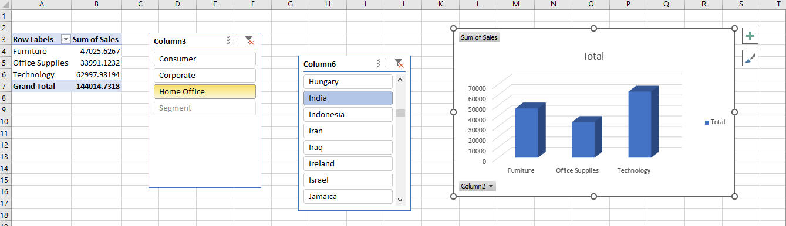

# revenue-distribution-analysis
An interactive data visualization project tracking revenue distribution across key product categories to identify top-performing streams and optimize sales strategies.
# Enterprise Sales Performance Dashboard (SQLite & Excel)

## 📌 Project Overview
This project demonstrates an end-to-end data pipeline modeling a production corporate workflow. Raw transactional e-commerce data was structured, queried, and verified using **DB Browser for SQLite**, and then connected directly to **Microsoft Excel** to build a dynamic, executive-ready sales performance dashboard.

## 📊 Dashboard Preview


## ⚙️ Data Architecture & Pipeline Workflow
1. **Database Staging:** Created a localized relational database schema using **SQLite** to securely store massive transactional datasets within the `fact_orders` structure.
2. **SQL Analytics Engine:** Executed data aggregation scripts in **DB Browser for SQLite** to establish core business KPI baselines.
3. **Excel Integration:** Connected the Excel data analytics engine directly to the local SQLite database file to feed clean, structured tables into Pivot Charts.

## 🛠️ Tech Stack & Tools
* **Database Management:** DB Browser for SQLite
* **SQL Dialect:** SQLite Standard SQL
* **Data Visualization & Analytics:** Microsoft Excel (Pivot Tables, Pivot Charts, Slicers)

## 🔍 Key SQL Queries Implemented

### Business KPI Validation Query
This script was executed to establish baseline financial targets before designing visual charts:

```sql
-- Compute target baseline numbers for our validation phase
SELECT
    ROUND(SUM(Sales), 2) AS Baseline_Sales,
    SUM(Quantity) AS Total_Units_Sold,
    ROUND(AVG(Sales), 2) AS Avg_Order_Value
FROM fact_orders;
```

## 📊 Verified Business Baseline Metrics
* **Total Baseline Sales Volume:** $12,642,501.91
* **Total Volume Shipped:** 178,312 Units
* **Average Ticket Size (AOV):** $246.49

## 💡 Key Business Insights Discovered
* **Revenue Distribution:** Technology stands out as the primary revenue-driving product category, followed closely by Furniture and Office Supplies.
* **Interactive Dynamic Slicing:** Built advanced cross-filtering capabilities utilizing **Market Heading** (Consumer, Corporate, Home Office) and **Country Selection** to allow localized regional performance tracking.
* **Workflow Optimization:** Automated the sales tracking pipeline, eliminating manual data entry routines into Excel spreadsheets.
